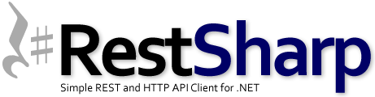

<!-- PROJECT SHIELDS -->

       
  
  
  

<!-- PROJECT LOGO -->
 

  

  <h3 align="center">RestSharp.Demo</h3>

  

    An awesome README template to jumpstart your projects!
     
    <a href="#about-the-project"><strong>Read Instructions »</strong></a>
     
     
    <a class="btn btn-outline get-repo-btn  btn-block" rel="nofollow" data-hydro-click="{&quot;event_type&quot;:&quot;repository.click&quot;,&quot;payload&quot;:{&quot;target&quot;:&quot;DOWNLOAD_BUTTON&quot;,&quot;user_id&quot;:30802898,&quot;record_id&quot;:174082407,&quot;client_id&quot;:&quot;1915608595.1543900764&quot;,&quot;originating_request_id&quot;:&quot;F614:521B:7E9C83:1010F2A:5C862168&quot;,&quot;originating_url&quot;:&quot;https://github.com/mahmoudazaid/RestSharp.Demo&quot;}}" data-hydro-click-hmac="2ca6b5e53eb889ab8d811c790b1081d795efaa09bdaab7c38f3424f81ae297fb" data-ga-click="Repository, download zip, location:repo overview" href="/mahmoudazaid/RestSharp.Demo/archive/master.zip">View Demo</a>
    ·
    <a href="https://github.com/mahmoudazaid/RestSharp.Demo/issues">Report Bug</a>
    ·
    <a href="https://github.com/mahmoudazaid/RestSharp.Demo/issues">Request Feature</a>
  

# RestSharp.Demo

<!-- TABLE OF CONTENTS -->
## Table of Contents

* [About the Project](#about-the-project)
  * [Built With](#built-with)
* [Getting Started](#getting-started)
  * [Prerequisites](#prerequisites)
  * [Installation](#installation)
* [Usage](#usage)
* [Contributing](#contributing)
* [Contact](#contact)

<!-- ABOUT THE PROJECT -->

## About The Project

This project for build a powerful testing framework to test APIs with RestSharp, SpecFlow the framework built on .Net Framework4.6.1.
The Demo APIs used from this websit (http://dummy.restapiexample.com/)

### Built With
The Framework built with below main packages
* [SpecFlow](https://specflow.org/)
* [RestSharp](http://restsharp.org)
* [FluentAssertions](https://fluentAssertions.com)
* [NUnit](https://nunit.org)

<!-- GETTING STARTED -->
## Getting Started

This is instructions on setting up your project locally.
To get a local copy up and running follow these simple example steps.

### Prerequisites

* Visual Studio
* Create a Unit Test Project .net framework

### Installation
* Install Packages from Nuget Manager
1. RestSharp
2. SpecFlow
3. Nunit
4. FluentAssertions

<!-- USAGE EXAMPLES -->
## Usage

To run tests use Test Explorer

_For more examples, please refer to the [Documentation](https://example.com)_

<!-- CONTRIBUTING -->
## Contributing

Contributions are what make the open source community such an amazing place to be learn, inspire, and create. Any contributions you make are **greatly appreciated**.

1. Fork the Project
2. Create your Feature Branch (`git checkout -b AmazingFeature`)
3. Commit your Changes (`git commit -m 'Add some AmazingFeature'`)
4. Push to the Branch (`git push origin AmazingFeature`)
5. Open a Pull Request

<!-- CONTACT -->
## Contact

Mahmoud A. Zaid - [Linkedin](https://www.linkedin.com/in/mahmoudazaid/)

Project Link: [RestSharp.Demo](https://github.com/mahmoudazaid/RestSharp.Demo)

